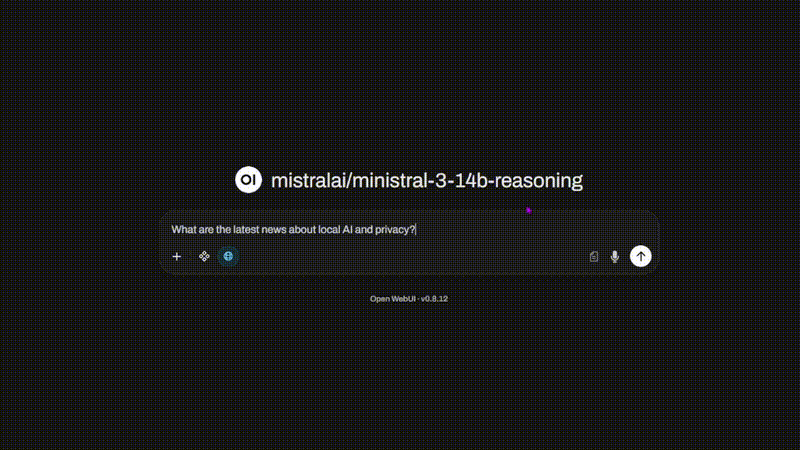

# Local AI Agent

A fully local AI assistant stack running on your own hardware, no cloud, no data sharing.
Combines LM Studio, Open WebUI, and SearXNG to give you a private ChatGPT-like experience
with real-time web search capabilities.



## Stack

| Component | Role |
|-----------|------|
| [LM Studio](https://lmstudio.ai) | Runs local LLMs |
| [Open WebUI](https://github.com/open-webui/open-webui) | Chat interface |
| [SearXNG](https://github.com/searxng/searxng) | Privacy-focused web search |

---

## Why local?

- Your conversations never leave your machine
- No API costs or usage limits
- Full control over which model you run
- Works offline except for web search

---

## Requirements

- [Docker](https://www.docker.com/) and Docker Compose
- [LM Studio](https://lmstudio.ai/download) installed
- Nvidia GPU with CUDA support (tested on RTX 4070 12GB)
- A compatible LLM model (see [Recommended Models](#recommended-models))

> Hardware requirements vary depending on the model you choose. Larger models need more VRAM.
> CPU-only setups are possible but significantly slower.

---

## Installation

### 1. Clone the repository
```bash
git clone https://github.com/eloymelo/Local-AI-Agent
cd Local-AI-Agent
```

### 2. Start SearXNG
```bash
cd searxng
docker compose up -d
```

> This creates two folders inside `searxng/`: `config/` and `data/`

### 3. Configure SearXNG
1. Open `./searxng/config/settings.yml`
2. Copy the value of `secret_key`
3. Delete `settings.yml`
4. Rename `example_settings.yml` to `settings.yml` and move it to `./config/`
5. Paste your `secret_key` into the new file
6. Restart:
```bash
docker compose down && docker compose up -d
```

SearXNG is now available at `http://localhost:8888`

### 4. Start Open WebUI
```bash
cd ../openwebui
docker compose up -d
```

Open WebUI is now available at `http://localhost:3000`

### 5. Connect LM Studio
1. Open LM Studio and load a model
2. Go to **Developer** tab and start the local server
3. In Open WebUI go to **Settings → Connections**
4. Set the API URL to `http://host.docker.internal:1234/v1`

### 6. Enable web search
1. In Open WebUI go to **Admin Settings → Web Search**
2. Set engine to `searxng`
3. Set query URL to `http://host.docker.internal:8888/search?q=<query>&format=json`

---

## Recommended Models

- **General use**: Qwen2.5-14B-Instruct Q4_K_M or Ministral-3-14b-Reasoning Q4_K_M
- **Coding**: Qwen2.5-Coder-14B-Instruct Q4_K_M
- **Vision**: Gemma-4-26B

---

## Docs

- [Full Setup Guide](docs/setup.md)
- [Troubleshooting](docs/troubleshooting.md)